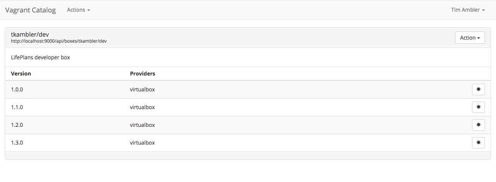

# Vagrant Catalog



This application allows you to run your own private Vagrant cloud instance. In other words, it provides a UI for managing boxes, which can then be referenced in a Vagrantfile as shown below:

```
Vagrant.configure("2") do |config|

    config.vm.box = "org/box-name"
    config.vm.box_url = "https://vagrant.myorg.com/api/boxes/org/box-name"
    
end
```

## Running Vagrant Catalog

Modify `docker-compose.yml` as needed and run:

    $ docker-compose up -d

Or:

    $ docker run --rm -ti \
        -p "9000:9000" \
        -v /boxes:/opt/app/boxes \
        -e PORT=9000 \
        -e BASE_URL="http://mysite.com:9000" \
        tkambler/vagrant-catalog

## Building Docker Images

    $ docker build -f Dockerfile.base -t vagrant-catalog-base . && \
        docker build -t tkambler/vagrant-catalog .
